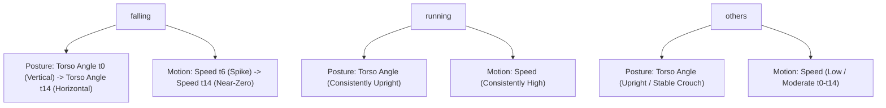

# Feature Engineering Blueprint: 3-Class Behavior Classification

This document provides a consolidated list of the **141 engineered features** required to train a machine learning model (e.g., Random Forest, XGBoost, or LightGBM) to classify sliding-window worker trajectories into three target classes:
* **`falling`**: Falling motion, collapses, and lying on the floor.
* **`running`**: Stable high-speed movement.
* **`others`**: Aggregated class for normal stationary states, walking, bending, crouching, and kneeling.

All spatial features are normalized relative to the bounding box height or diagonal (body size) to achieve scale and position invariance.

---

## 1. Sliding Window Configuration
All features are computed over a sliding temporal window extracted per worker track ID:
* **Window Length**: 60 frames (2.5 seconds at 24 FPS)
* **Stride**: 12 frames (0.5 seconds)

---

## 2. Coalesced Shape Ratio & Fallback Logic
To simplify the feature space and avoid collinearity while preserving detection safety, **Bounding Box Aspect Ratio is merged into Skeleton Spread Ratio**. 

For any given frame/step, the shape ratio is computed as:
$$\text{Coalesced Shape Ratio} = \begin{cases} \text{Skeleton Spread Ratio} = \frac{X_{\text{max}} - X_{\text{min}}}{Y_{\text{max}} - Y_{\text{min}}} & \text{if skeleton keypoints are visible/valid} \\ \text{BBox Aspect Ratio} = \frac{\text{BBox Width}}{\text{BBox Height}} & \text{if skeleton is not visible/invalid} \end{cases}$$

---

## 3. Engineered Feature Directory

### Group A: Posture Geometry (2D Image Space - 6 features)
These features characterise body posture using YOLO-Pose keypoints. To generalise across varying camera distances, all spatial distances are normalised by body scale ($BodySize = BBoxDiagonal$).

| Feature Name | Description | Measurement Unit | Typical Value Range | Purpose |
| :--- | :--- | :--- | :--- | :--- |
| `torso_angle_mean` | Average angle of the torso vector (hip center to shoulder center) relative to horizontal. | **Degrees** | $[0, 90]$ | Standing ($70-90^\circ$) vs. Lying ($0-25^\circ$). |
| `torso_angle_std` | Standard deviation of the torso vector angle across the window. | **Degrees** | $[0, 45]$ | Captures sudden torso rotation during a fall (stable: $0-3^\circ$, fall: $10-35^\circ$). |
| `head_hip_compression_mean` | Average ratio of vertical nose-to-hip Y-distance to bounding box height. | **Dimensionless ratio** | $[0, 1.0]$ | Bending and crouching ($<0.45$) vs. standing ($>0.75$). |
| `hip_ankle_vertical_diff_mean` | Average vertical distance between hip center and ankle midpoint, normalised and clamped to 1.0 maximum. | **Dimensionless ratio** | $[0, 1.0]$ | Standing/running (high split: $0.7-0.9$) vs. lying flat ($0.0-0.2$). |
| `skeleton_spread_ratio_mean` | Average **Coalesced Shape Ratio** across the window. | **Dimensionless ratio** | $[0, \infty)$ | Standing (narrow, $<0.6$) vs. lying (wide, $>1.2$). |
| `skeleton_spread_ratio_max` | Maximum **Coalesced Shape Ratio** observed in the window. | **Dimensionless ratio** | $[0, \infty)$ | Captures brief horizontal layout expansions (typically $0.2-2.5$). |

---

### Group B: Locomotion & Speed Dynamics (7 features)
These features evaluate movement speeds from both floor contact points and body size changes.

| Feature Name | Description | Measurement Unit | Typical Value Range | Purpose |
| :--- | :--- | :--- | :--- | :--- |
| `ground_speed_mean` | Average frame-over-frame displacement of the ground point (ankle midpoint or box bottom-center), normalised by body height. | **Body Heights per second** ($s^{-1}$) | $[0, \infty)$ | Distinguishes walking ($0.2–0.8$) vs. running ($>1.10$). |
| `ground_speed_max` | Maximum ground speed recorded in the window. | **Body Heights per second** ($s^{-1}$) | $[0, \infty)$ | Identifies peak velocity during a sprint or fall transition ($0.1-5.0$). |
| `scale_speed_mean` | Average rate of change of bounding box height: $\frac{\|H_t - H_{t-1}\|}{H_t \cdot \Delta t}$. | **Fractional size change per second** ($s^{-1}$) | $[0, \infty)$ | Captures speed toward/away from camera (typically $0.0-2.0$). |
| `combined_speed_mean` | Average of $GroundSpeed + 0.45 \cdot ScaleSpeed$. | **Body Heights per second** ($s^{-1}$) | $[0, \infty)$ | Primary metric for identifying overall locomotion velocity. |
| `combined_speed_std` | Standard deviation of combined speed. | **Body Heights per second** ($s^{-1}$) | $[0, \infty)$ | Running exhibits high stable speed ($<0.2$); falls exhibit a sudden spike ($>0.5$). |
| `body_speed_max` | Peak speed of body center (average of shoulders & hips), normalized by body diagonal scale. | **Body Heights per second** ($s^{-1}$) | $[0, \infty)$ | Detects rapid downward acceleration during a collapse ($0.0-4.0$). |
| `body_acceleration_max` | Maximum change in body center speed over consecutive frames. | **Body Heights per second squared** ($s^{-2}$) | $[0, \infty)$ | Distinguishes sudden fall drop ($>3.0$) from constant speed running ($<0.5$). |

---

### Group C: 15-Point Periodic Time-Series Features (120 features)
Rather than manually calculating difference deltas over arbitrary segments, we sample the 60-frame window at a regular stride of **4 frames**. This yields exactly **15 discrete sample steps** (frames 0, 4, 8, 12, 16, 20, 24, 28, 32, 36, 40, 44, 48, 52, 56). 

At each sample step $i \in \{0, 1, ..., 14\}$, we extract the local normalised posture and motion metrics. This flattens into $15 \times 8 = 120$ columns, letting the tree classifier learn complex non-linear temporal relationships.

- **Feature Column Name Format**: `step_<metric_name>_t{i}` (e.g. `step_torso_angle_t0` through `step_body_speed_t14`).

| Column Name Format | Feature Type | Measurement Unit | Typical Value Range |
| :--- | :--- | :--- | :--- |
| `step_torso_angle_t{i}` | Torso vector angle relative to horizontal at step $i$. | **Degrees** | $[0, 90]$ |
| `step_compression_t{i}` | Vertical head-hip distance divided by box height at step $i$. | **Dimensionless ratio** | $[0, 1.0]$ |
| `step_spread_ratio_t{i}` | **Coalesced Shape Ratio** at step $i$. | **Dimensionless ratio** | $[0, \infty)$ |
| `step_combined_speed_t{i}` | Normalized combined ground + scale speed at step $i$. | **Body Heights per second** ($s^{-1}$) | $[0, \infty)$ |
| `step_hip_ankle_t{i}` | Relative vertical distance between hip center and ankle midpoint at step $i$ (clamped to 1.0 max). | **Dimensionless ratio** | $[0, 1.0]$ |
| `step_ground_speed_t{i}` | Normalized ground displacement speed at step $i$. | **Body Heights per second** ($s^{-1}$) | $[0, \infty)$ |
| `step_scale_speed_t{i}` | Normalized change in bounding box height at step $i$. | **Body Heights per second** ($s^{-1}$) | $[0, \infty)$ |
| `step_body_speed_t{i}` | Normalized speed of the body center at step $i$. | **Body Heights per second** ($s^{-1}$) | $[0, \infty)$ |

#### Why this Decimation works:
1. **Lowers Dimensionality**: Keeps temporal features to exactly 120 inputs, reducing model overfitting.
2. **Filters Noise**: Downsampling from 24 FPS to 6 FPS acts as a natural smoothing filter, removing camera jitter.
3. **Learns Time Transitions**: Allows tree splits like: `if step_torso_angle_t10 < 30 and step_torso_angle_t2 > 70` $\rightarrow$ `fall_transition`.

---

### Group D: Final Window Posture & Stillness (4 features)
Evaluates movement and stillness over the final 1.0 second (last 24 frames) of the sliding window to identify post-fall states.

| Feature Name | Description | Measurement Unit | Typical Value Range | Purpose |
| :--- | :--- | :--- | :--- | :--- |
| `final_lying_score` | A combined metric aggregating low torso angle, wide coalesced shape ratio, and low speed in the final second. | **Dimensionless score** | $[0, 1.0]$ | Specifically flags the "lying still on floor" state (stable: $0.0$, collapsed: $>0.8$). |
| `final_1s_body_speed_mean` | Average body center speed in the last second. | **Body Heights per second** ($s^{-1}$) | $[0, \infty)$ | Distinguishes running ($>0.8$) from fall/stillness ($0.0-0.05$). |
| `final_1s_joint_motion_mean` | Average coordinate displacement of all visible joint keypoints in the last second. | **Body Heights per second** ($s^{-1}$) | $[0, \infty)$ | Distinguishes constant-speed walking ($>0.15$) from a fallen worker lying still ($<0.01$). |
| `final_1s_joint_motion_std` | Standard deviation of joint displacements in the last second. | **Body Heights per second** ($s^{-1}$) | $[0, \infty)$ | Crouching/kneeling workers still show hand/head movements; fallen workers are typically motionless ($0.0-0.5$). |

---

### Group E: Quality Control & Diagnostics (4 features)
Safeguards the sequence against noisy or missing coordinate frames.

| Feature Name | Description | Measurement Unit | Typical Value Range | Purpose |
| :--- | :--- | :--- | :--- | :--- |
| `avg_keypoint_confidence` | Mean confidence score across all 17 skeleton keypoints in the window. | **Dimensionless confidence** | $[0, 1.0]$ | Tells the model to ignore noisy/occluded skeletons (reliable: $>0.7$, bad: $<0.3$). |
| `missing_ankle_ratio` | Percentage of frames in the window where ankle keypoints fall below confidence $0.1$. | **Dimensionless ratio** | $[0, 1.0]$ | Adjusts weight of ground-speed measurements if ankles are occluded ($1.0$ is fully hidden). |
| `missing_hip_ratio` | Percentage of frames in the window where hip keypoints fall below confidence $0.1$. | **Dimensionless ratio** | $[0, 1.0]$ | Adjusts weight of torso measurements if hips are occluded ($1.0$ is fully hidden). |
| `skeleton_jump_score` | Maximum frame-to-frame change in body center coordinate position. | **Body Heights** | $[0, \infty)$ | Flags track swaps or ID swaps (stable: $<0.1$, track swap: $>0.6$). |

#### Missing Value Strategy (For Group C Time-series):
If keypoints are lost/occluded on a specific sample step (e.g. frame 24), apply **linear interpolation** from the nearest valid steps in the window before flattening, preventing `NaN` inputs.

---

## 4. How the Classifier Learns the Boundaries

