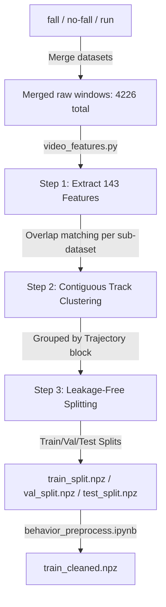

# Data Preprocessing Guide: Pose-Video Labeling Dataset

This guide outlines the steps and tasks to extract features and preprocess the combined `/pose-export-trial` dataset for machine learning models.

---

## 1. Overview of Exported Dataset

The `/pose-export-trial` directory contains three sub-directories representing separate exports:
- `fall/`: 1,372 windows (242 trajectories)
- `no-fall/`: 1,555 windows (279 trajectories)
- `run/`: 1,299 windows (278 trajectories)

Each sub-directory contains a complete export package with a `manifest.json`, `annotations.jsonl`, and `keypoint_windows.npz`.

---

## 2. Feature Extraction & Preprocessing Pipeline

To clean, split, and format this combined dataset for models like XGBoost, Random Forest, or LightGBM, the pipeline implements a database-independent spatial normalization and track clustering model.



### Step 1: Extract the 143 Pre-Engineered Features
Instead of training on raw coordinates, the pipeline utilizes the backend module [video_features.py](file:///D:/Bill/IT/RMIT/Capstone/supported_tools/AutoLabeling/backend/app/services/video_features.py) to calculate the 143 physical movement descriptors:
- **Posture Geometry (13 features)**: Mean and std of torso angle, head-hip compression, hip-ankle horizontal offsets, and height spreads.
- **Decimated Time Series (120 features)**: Sampling 8 motion metrics across 15 temporal steps in the 60-frame window.
- **Final Period Stillness (4 features)**: Motion mean, std, and lying metrics in the last 1.0 second of the window.
- **Quality Metrics (6 features)**: Mean confidence, missing joint ratios, and track gap counts.
- **Normalizing & Capping**: Any values in the 16 `hip_ankle` columns that exceed `1.0` (due to YOLO detector inaccuracies where joints fall outside bounding boxes) are clipped to `1.0`.

### Step 2: Database-Independent Track Clustering
To enable leakage-free splitting without accessing the local database:
- **Contiguity Test**: Adjacent windows $i$ and $i+1$ within the same sub-dataset boundary are matched using a 48-frame temporal overlap:
  $$\text{keypoints}[i, 12:60] == \text{keypoints}[i+1, 0:48]$$
- Adjacent windows that match are grouped into contiguous track blocks. This partitions the combined 4,226 windows into **799 unique trajectories**.

### Step 3: Leakage-Free Splitting
- Shuffles the 799 track blocks using a seed (`42`) for reproducibility.
- Distributes windows to **Train (70%)**, **Validation (15%)**, and **Test (15%)** sets.
- Shuffling and splitting by track block guarantees that overlapping sliding windows are kept together in the same split, eliminating window-overlap data leakage.

---

## 3. Preprocessed Split Statistics

The combined dataset contains 4,226 windows with the following class distribution:
* **Class 0 (others)**: 3,063 windows
* **Class 1 (running)**: 322 windows
* **Class 2 (falling)**: 841 windows

---

## 4. Run the Pipeline
To extract features and regenerate the splits, execute the standalone script inside your terminal:
```powershell
uv run python extract_engineered_features.py
```
This outputs three distinct NPZ archives:
- `train_split.npz` (contains keys `X`, `y`, `video_ids` for the training set).
- `val_split.npz` (contains keys `X`, `y`, `video_ids` for the validation set).
- `test_split.npz` (contains keys `X`, `y`, `video_ids` for the test set).

### 5. Resampling and Balancing
Run the cells in **[behavior_preprocess.ipynb](file:///D:/Bill/IT/RMIT/Capstone/supported_tools/ModelTrainingPipeline/behavioral-detection/behavior_preprocess.ipynb)** to balance class counts in the training set (oversampling `running`/`falling` and undersampling `others` to 1,200 samples each). This exports:
- **`train_cleaned.npz`** (contains keys `X` and `y` for the balanced training set, ready to be ingested directly by models).
